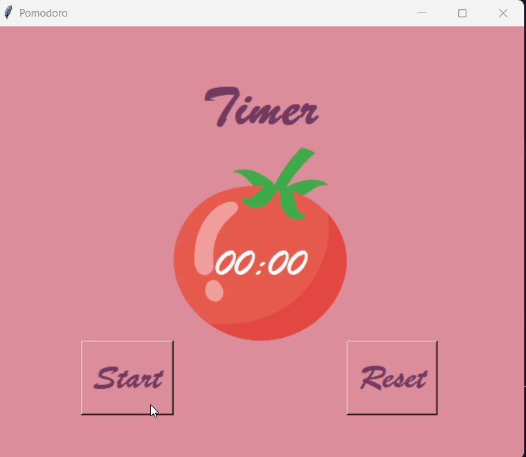

# ⏳ Pomodoro Timer ⏰

A simple yet visually appealing **Pomodoro Timer** built using **Python** and **Tkinter**. This app helps improve productivity by dividing work into focused intervals, following the **Pomodoro Technique**.

---

## 📷 Demo

---

## 🧠 What is the Pomodoro Technique?

The **Pomodoro Technique** is a time management method developed by *Francesco Cirillo*. It uses a timer to break down work into intervals, traditionally:

- 🕒 **25 minutes of focused work**
- 🛑 Followed by a **5-minute short break**
- 🔁 After 4 work sessions, take a **20-minute long break**

This cycle helps:
- Increase focus and motivation
- Reduce mental fatigue
- Encourage consistent productivity

---

## 📌 Features

- ⏱️ Fully functional **countdown timer**
- 🔁 Automatically starts **breaks and work sessions** in sequence
- 🧠 Tracks **repetitions** (reps) to determine current session type
- ✅ Displays **check marks (✓)** for each completed work session
- 🎨 **Customizable UI** with canvas-based layout and colorful theme
- 🔔 Optional: Add sound alerts for session transitions

---

## 🛠️ Built With

- **Python 3**
- **Tkinter** (standard GUI library for Python)
- **math** module (for time calculations)
- `after()` method for scheduling countdown callbacks

---

## 🎮 How It Works

### ▶️ Start the Timer

- Click the **Start** button to begin a 25-minute work session.
- The label updates to **"Work"**, and the timer starts counting down.
- After 25 minutes, it switches to:
  - A **5-minute short break**
  - After every 4 work sessions, a **20-minute long break**

### 🔁 Reset the Timer

- Click the **Reset** button to:
  - Cancel the current countdown
  - Reset the timer to `00:00`
  - Clear all check marks
  - Reset repetition count to 0

---

## 🧩 Code Overview

### 🔄 Timer Logic (Simplified)

if reps % 8 == 0:
    # Long break after 4 work sessions
elif reps % 2 == 0:
    # Short break after each work session
else:
    # Start a work session

---

## ⌛ Countdown Function

⏳ Calculates minutes and seconds from the total time (in seconds)

🔁 Uses after() to update the countdown every second

⏱️ When the timer reaches 00:00, it automatically:

Starts the next session (work or break)

Updates the checkmark display to reflect completed work sessions (✓)

---

## 🖼️ UI Design

🎨 Uses a Canvas widget to:

Display a tomato image (Pomodoro symbol)

Overlay the countdown timer text

🧰 UI Components include:

Start and Reset buttons

A dynamic Timer label (Work / Break)

A check mark display below the timer to track completed sessions

---

## 🛠️ Requirements

🐍 Python 3.x

🖼️ tkinter (standard Python GUI library, comes pre-installed)
